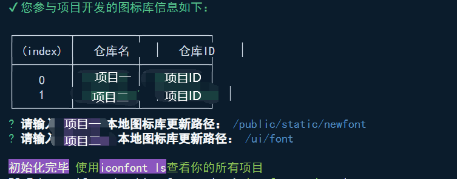
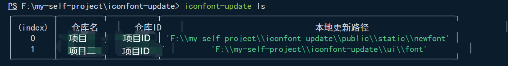
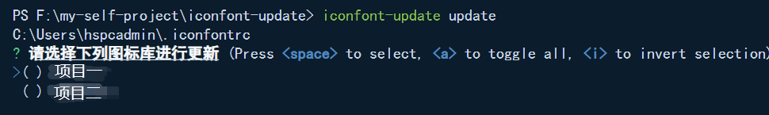
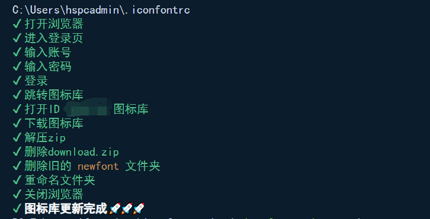

# iconfont-update-cli

## 本地项目图标库更新工具（参与项目）

[图标库更新工具](https://www.npmjs.com/package/iconfont-update-cli)

### 全局安装

```node
npm install iconfont-update-cli -g
```

### 指令集合

| 指令                        | 说明                                         |
| :-------------------------- | -------------------------------------------- |
| ``iconfont-update -V``      | 查看``iconfont-update-cli``版本              |
| ``iconfont-update init``    | 查询远程仓库初始化本地信息                   |
| ``iconfont-update ls``      | 查看参与图标库列表信息                       |
| ``iconfont-update update``  | 选中要更新的图标库，将远程图标库拉取更新本地 |
| ``iconfont-update preview`` | 预览本地图标库，增加图标点击自动选中复制功能 |
| ``iconfont-update compare`` | 本地图标库与远程图标库进行差异对比           |

### 使用示例

1. ``iconfont-update init``

   

   

2. ``iconfont-update ls``

   

3. ``iconfont-update update``

   

   

4. ``iconfont-update preview``

   

   启动浏览器预览本地图标库demo_index.html，图标Unicode，class，symbol点击自动选中复制

5. ``iconfont-compare``

   启动浏览器在同一页面进行本地图标库与远程对比